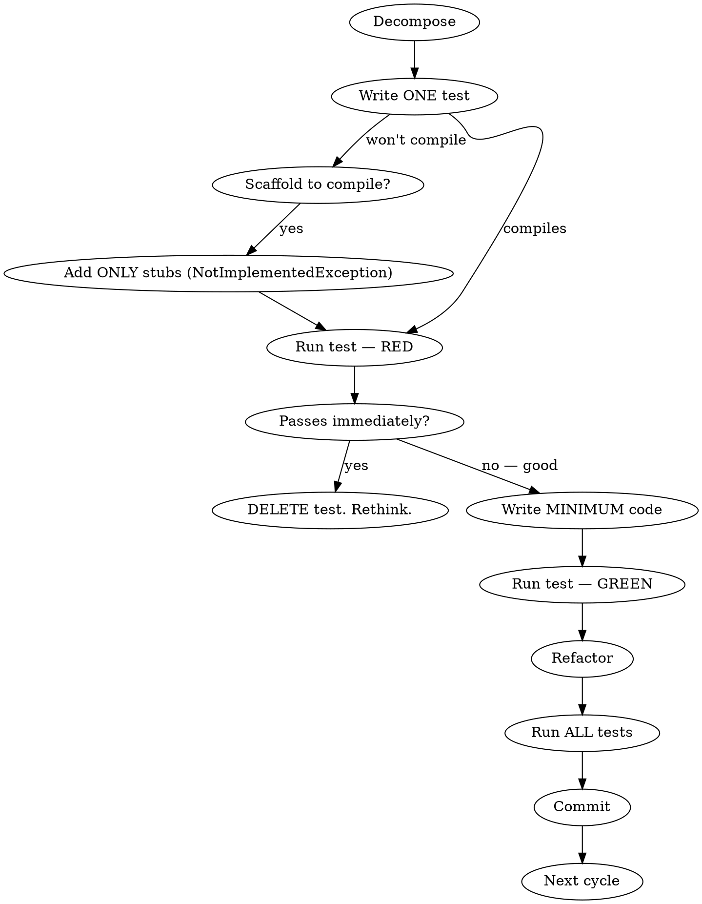

Implement a strict test-driven development workflow (Red-Green-Refactor). **Violating the letter of these rules IS violating the spirit.**

## Before Touching Any Code: Decompose

List every discrete testable behavior the feature requires. Each item becomes one TDD cycle.

Example for "add UpdateStock endpoint":
1. Update an existing stock returns updated DTO
2. Update a non-existent stock returns null
3. Controller PUT endpoint returns 200 or 404

Do not start coding until the decomposition is written down.

## The Cycle

1. Write the simplest test for ONE behavior from the decomposition.
2. If the test won't compile (C#/typed languages): add ONLY the types and stubs needed to compile. Stubs throw `NotImplementedException`. This is scaffolding, not implementation.
3. Run `dotnet test` — confirm the new test FAILS (Red). If it passes, see "Test passes immediately" below.
4. Write the minimum code to make the test pass. Nothing more.
5. Run `dotnet test` — confirm it PASSES (Green).
6. Refactor if needed, keeping all tests green.
7. Commit.

Repeat for each behavior in the decomposition.

## Scaffolding in Statically-Typed Languages

C# requires types and method signatures to exist before tests compile. This is NOT an excuse to write real implementation.

**Allowed scaffolding:**
- Empty DTO records with correct signatures
- Interface method declarations
- Method bodies that `throw new NotImplementedException()`

**NOT scaffolding (this is production code):**
- Any logic in method bodies
- Any mapping, querying, or branching
- "I'll just write a simple implementation since I'm here"

The test must compile and FAIL. That's the only goal of scaffolding.

## Test Passes Immediately

If a new test passes without writing any production code:

- **The behavior already exists.** The test is a characterization test, not TDD. Label it as such in the commit message ("characterization test: ...") and move on.
- **Do NOT pretend this was a red-green cycle.** Do NOT skip to writing implementation.
- **Consider if the decomposition was wrong.** Maybe the behavior isn't discrete enough.

## Granularity: What Is "One Discrete Behavior"?

- **One behavior = one reason to fail.** If a test can fail because the ticker wasn't updated OR because the price wasn't updated, that's two behaviors.
- **Exception for uniform property mapping:** When all fields follow the same trivial pattern (`entity.X = dto.X`) with no branching, one test covering all fields is acceptable. But if ANY field has special handling, each field gets its own test.
- **When in doubt, more granular is safer.** You can always decide a test is unnecessary after seeing it pass. You can't retroactively TDD something you already built.

## Rules

- Never write more than one failing test at a time.
- Never implement more than one behavior at a time.
- Never write production code without a failing test driving it (scaffolding exemption above).
- Never skip running `dotnet test` to confirm red. Never skip running it to confirm green.
- Keep tests focused: one assertion per test where possible.
- Name tests: `MethodName_Scenario_ExpectedResult`.
- **Every cycle must have a visible red and a visible green in the test output.** If you didn't see both, the cycle didn't happen.

## Controller and Integration Testing

The SERVICE is the primary TDD target. Controllers do not need their own unit tests when they are thin pass-throughs.

**Thin pass-through (no test needed):** A controller method that calls one service method and maps the result to an HTTP status. The `if (result is null) NotFound() else Ok(result)` pattern is standard REST plumbing — not "logic" that needs its own test.

**Needs its own test:** A controller method that does validation, orchestrates multiple service calls, transforms data, or has conditional logic beyond a single null check.

After all service tests pass, add the controller method and run `dotnet test` to confirm nothing broke. This is a regression check, not a TDD cycle.

## Red Flags — STOP and Redo

These thoughts mean you are rationalizing a shortcut:

| Thought | Reality |
|---------|---------|
| "This is too simple to need TDD" | Simple things break. The cycle takes 2 minutes. Do it. |
| "I'll write the tests after" | Tests-after confirm what you built. Tests-first define what to build. Different things. |
| "We're behind schedule" | Skipping TDD doesn't save time. It moves the debugging to later when you're more behind. |
| "I already know this works" | Then the test will pass in 30 seconds. Write it anyway. |
| "I'll just write the DTO and interface first, then test" | That's production code. Scaffold stubs only. |
| "The spirit matters more than the letter" | The letter IS the spirit. Shortcuts compound. |
| "I'll batch these since they're all the same pattern" | Decompose first. If they're truly identical, the decomposition will show that. |
| "Testing each field separately is absurd" | See granularity rules above. Uniform mapping is the one exception. |

## For This Project

- Tests: xUnit + EF Core InMemory (`StockTracker.Api.Tests/`)
- Run: `dotnet test` from solution root
- Primary test target: Services (`StockService`, etc.)
- DTOs: Records in `StockTracker.Core/Dtos/`
- Test naming: `MethodName_Scenario_ExpectedResult`
- Each test gets a unique InMemory DB name
